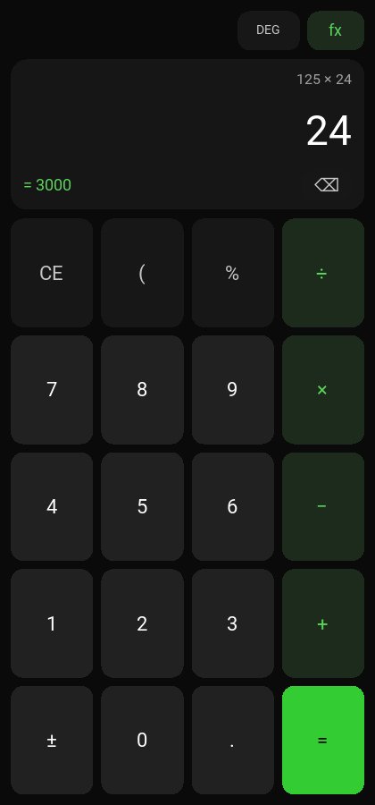
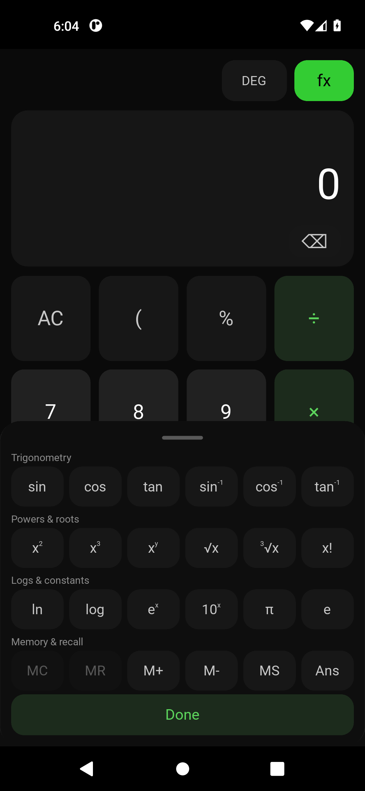

# Cinqic Calculator

A private, offline-first calculator for Windows, Linux, and Android.


*The desktop interface: the full expression, the value being typed, and the answer it would produce — before `=` is pressed.*

 

*The Android interface and the scientific sheet. Both captured from a real Android emulator in CI, driven by actual taps.*

Standard and scientific calculations with a live answer preview, unit
conversion, practical financial tools, and optional local history — without an
account, a cloud service, or an internet connection.

**Juniper is not integrated into Cinqic Calculator. The calculator works fully
without AI.** See [About Juniper](#juniper-relationship) below.

## What's new in 1.1.0

- **Live answers.** The expression you are building stays on screen and its
  result appears as you type, before you press `=`.
- **A tactile Android keypad.** Keys respond with a short spring press, new
  digits animate into the display, and optional haptic feedback confirms each
  touch. A reduced-motion setting turns the movement off while keeping instant
  feedback.
- **A redesigned scientific mode** that slides up over the keypad as a grouped
  sheet, instead of expanding the screen into an endless grid of small keys.
- **More maths:** parentheses, `x^y`, `Ans`, `eˣ`, `10ˣ`, inverse
  trigonometry, and hyperbolic functions.
- **Linux is a supported platform**, tested in CI and shipped as a standalone
  tarball.
- **Relicensed under the Apache License 2.0.**

See [CHANGELOG.md](CHANGELOG.md) for the full list, including one behaviour
change worth knowing about.

## Features

- **Standard calculator** — arithmetic, decimals, percentages, parentheses,
  sign toggle, backspace, a clear key that shows whether it will clear the
  entry or everything, and repeated equals.
- **Live expression and answer preview** — the full expression is shown as you
  build it, with the result it would produce. A half-typed expression stays
  quiet rather than flashing an error.
- **Scientific mode** — powers, roots, reciprocal, factorial, absolute value,
  π, e, natural and base-10 logarithms, exponentials, sine/cosine/tangent and
  their inverses, hyperbolic functions, and a persistent degree/radian mode.
- **`Ans`** — reuse the previous result in a new calculation, kept separate
  from calculator memory.
- **Calculator memory** — MC/MR/M+/M−/MS with a visible indicator.
- **Unit conversion** — length, mass, temperature, area, volume, speed, time,
  and data storage (decimal KB/MB/GB kept distinct from binary KiB/MiB/GiB).
- **Financial tools** — percentages, discounts, sales tax, tips, bill
  splitting, simple and compound interest — clearly labelled as estimates.
- **Local calculation history** (up to 200 entries), fully optional.
- **Accessibility** — reduced motion, keyboard navigation with visible focus,
  adaptive text sizing for long results, WCAG AA contrast in both themes, and
  states never signalled by colour alone.
- **Optional haptics on Android**, using Android's built-in key-press feedback
  — which needs no permission, unlike the vibration APIs this app deliberately
  avoids.
- **Dark, light, and system themes.**
- **Fully offline.** No account, no telemetry, no analytics, no ads.

Arithmetic follows normal operator precedence: `2 + 3 × 4` is `14`. Since the
display shows the whole expression, evaluating it any other way would
contradict what you can see.

## Install

### Windows

1. Download `Cinqic-Calculator-Windows-x64-Setup.exe` from the
   [latest release](https://github.com/Cinqic/Cinqic-Calculator/releases/latest).
2. Run the installer. Administrator privileges are not required.
3. Launch **Cinqic Calculator** from the Start menu.

A portable build (`Cinqic-Calculator-Windows-x64-Portable.zip`) is also
available — unzip it and run `CinqicCalculator.exe` directly.

Requires Windows 10 or 11, 64-bit. Nothing else needs to be installed.

**SmartScreen note:** this build is not code-signed, so Windows may show an
"unrecognised app" warning the first time you run it. This is expected for an
unsigned open-source app; you can review the source yourself before continuing.

### Linux

1. Download `Cinqic-Calculator-Linux-x86_64.tar.gz` from the
   [latest release](https://github.com/Cinqic/Cinqic-Calculator/releases/latest).
2. Extract it and run the launcher:

```bash
tar -xzf Cinqic-Calculator-Linux-x86_64.tar.gz
./CinqicCalculator/cinqic-calculator
```

The bundle is self-contained: Python and Tk are included, so no system
packages are required to run it. A `cinqic-calculator.desktop` file is
included if you want a menu entry.

Requires a 64-bit x86 Linux distribution with glibc 2.35 or newer (Ubuntu
22.04 and later, Debian 12, Fedora 36+, and equivalents). Settings and history
are stored under `$XDG_DATA_HOME/Cinqic/Calculator` (by default
`~/.local/share/Cinqic/Calculator`).

Running from source on Linux additionally needs your distribution's Tk
package — `python3-tk` on Debian/Ubuntu, `python3-tkinter` on Fedora — because
`tkinter` is not included in a base Python install there.

### Android

Download `Cinqic-Calculator-Android.apk` from the
[latest Android release](https://github.com/Cinqic/Cinqic-Calculator/releases?q=android)
and open it. Android will ask you to allow "install unknown apps" for whichever
app you used to open the file — a normal requirement for any app installed
outside the Play Store.

- Package `com.cinqic.calculator`, Android 5.0 (API 21) or newer.
- **The app requests no permissions at all** — no internet, no storage access
  beyond its own private folder. You can verify this in
  [`android/buildozer.spec`](android/buildozer.spec) or by inspecting the APK
  manifest; CI asserts it on every build.
- Distributed as a direct, signed APK with a published SHA-256 checksum and
  signing certificate fingerprint — not through the Google Play Store.

Verify any download against the `SHA256SUMS` file published with the same
release.

## Privacy

Cinqic Calculator stores settings and optional history locally and never
transmits them anywhere. See [PRIVACY.md](PRIVACY.md) for specifics, including
exactly where that data lives on each platform.

## Build from source

```bash
git clone https://github.com/Cinqic/Cinqic-Calculator.git
cd Cinqic-Calculator
python -m venv .venv
source .venv/bin/activate          # Windows: .venv\Scripts\activate
pip install -e .
pip install -r requirements-build.txt
```

Run it:

```bash
python -m cinqic_calculator
```

### Tests

```bash
python -m pytest tests/ -v
```

The GUI smoke tests need a display. They skip themselves without one, so on a
headless Linux machine run them under a virtual display to actually exercise
the interface:

```bash
xvfb-run -a python -m pytest tests/ -v
```

Lint with `ruff check src tests android scripts`.

### Packaging

| Platform | Command | Notes |
| --- | --- | --- |
| Windows | `powershell -File scripts/build_windows.ps1` | Needs Inno Setup 6 for the installer. |
| Linux | `bash scripts/build_linux.sh` | Needs a Python with `tkinter` available. |
| Android | see [`android/README.md`](android/README.md) | Linux/CI only; cannot be built on Windows. |

Each desktop script runs the test suite, packages the app, smoke-tests the
resulting binary, and generates checksums. All exit non-zero if any step fails.

## Architecture

```
src/cinqic_calculator/     Shared, platform-independent core
  evaluator.py             Sandboxed AST expression evaluator (allowlist only)
  expression.py            Expression model + pure live-answer preview
  calculator.py            Calculator state machine, Ans, memory
  conversions.py           Unit conversion
  financial.py             Financial tools (Decimal-based)
  history.py settings.py storage.py
  ui/                      Tkinter desktop interface (Windows, Linux)
android/                   Kivy Android interface (separate frontend)
  logic.py                 Pure-Python glue and interaction decisions
  widgets.py               Reusable animated keypad button + scientific sheet
  screens/ kv/             Screens and their layouts
```

Both frontends are independent interfaces over the same tested core. Neither
imports the other. Anything that is a real decision rather than a layout detail
lives in plain Python — `src/cinqic_calculator/` or `android/logic.py` — so it
can be tested without a GUI toolkit or an Android device.

Expression evaluation goes through `evaluator.py`, which parses with Python's
`ast` module and walks only an explicit allowlist of node types. There is no
`eval()` or `exec()` anywhere in the project, and the live preview is a pure
function that cannot alter calculator state.

## Release process

Tagging a commit `vX.Y.Z` on `main` triggers
[`release-desktop.yml`](.github/workflows/release-desktop.yml): it runs the
test suite on Windows and Linux, builds the Windows installer and portable ZIP
and the Linux tarball, smoke-tests each packaged binary, generates one combined
`SHA256SUMS.txt`, verifies every asset against it, and publishes a release.
Both platforms ship from the same tag, so they always represent the same
version.

Tagging `android-vX.Y.Z` triggers
[`release-android.yml`](.github/workflows/release-android.yml): full test
suite, release APK build, signing, zip-align, signature verification,
package/permission inspection, and checksum generation — publishing only if
every step succeeds.

Every pull request runs the test suite and lint on both Windows and Linux (with
the Linux GUI tests under Xvfb), builds a debug APK, inspects its package
identity and permissions, and installs and drives the app on an Android
emulator.

## Juniper relationship

Cinqic Calculator is useful entirely on its own, without AI. Juniper —
Cinqic's local-first assistant — is **not** integrated into this release, on
any platform. Future versions may add optional local Juniper explanations,
while the calculator keeps working fully without them.

> AI should remain a choice.

## License

Apache License 2.0 — see [LICENSE](LICENSE) and [NOTICE](NOTICE).
Third-party components are listed in
[THIRD_PARTY_NOTICES.md](THIRD_PARTY_NOTICES.md).
