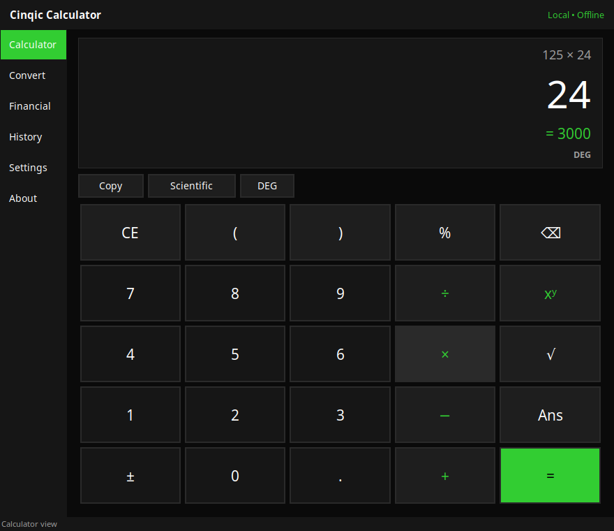

# Cinqic Calculator

A lightweight, private calculator for Windows and Android.




Perform standard and scientific calculations, convert common units, review
local calculation history, and use practical financial tools — without an
account, cloud service, or internet connection.

**Juniper is not integrated into Cinqic Calculator 1.0. The calculator
works locally without AI.** Juniper is Cinqic's future local-first
assistant; this app is built with it in mind, honestly, without pretending
it's already here. See [About Juniper](#juniper-relationship) below.

## Features

- Standard calculator: arithmetic, decimals, percentages, square root,
  parentheses (via keyboard/scientific expression entry), backspace,
  clear entry/all, repeated equals.
- Collapsible scientific mode: powers, roots, reciprocal, factorial,
  absolute value, π, e, ln, log₁₀, sin/cos/tan with degree/radian toggle.
- Calculator memory (MC/MR/M+/M-/MS) with a visible indicator.
- Full keyboard shortcut support.
- Unit conversion: length, mass, temperature, area, volume, speed, time,
  and data storage (decimal KB/MB/GB kept distinct from binary KiB/MiB/GiB).
- Financial tools: percentages, discounts, sales tax, tips, bill splitting,
  simple and compound interest — clearly labeled as estimates.
- Local calculation history (up to 200 entries), fully optional.
- Dark, light, and system themes.
- Fully offline. No account, no telemetry, no ads.

## Windows system requirements

- Windows 10 or Windows 11, 64-bit.
- No other software required — the installer and portable build include
  everything needed to run.

## Installation

1. Download `Cinqic-Calculator-Windows-x64-Setup.exe` from the
   [latest release](https://github.com/Cinqic/Cinqic-Calculator/releases/latest).
2. Run the installer and follow the prompts. Administrator privileges are
   not required after installation.
3. Launch **Cinqic Calculator** from the Start menu.

A portable version (`Cinqic-Calculator-Windows-x64-Portable.zip`) is also
available if you'd rather not install anything — unzip it and run
`CinqicCalculator.exe` directly.

**SmartScreen note:** this build is not code-signed. Windows may show an
"unrecognized app" warning the first time you run it. This is expected for
an unsigned open-source app; you can review the source code yourself before
choosing to continue.

Verify your download against `SHA256SUMS.txt` from the same release if
you'd like to confirm file integrity.

## Android

A separate, independent Android frontend built with
[Kivy](https://kivy.org) reuses the same tested calculation, conversion,
financial, history, settings, and storage logic as the Windows app — see
[`android/README.md`](android/README.md) for the app's layout and how to
build it (Linux/CI only; it cannot be built on Windows).

- Package: `com.cinqic.calculator` · Version 1.0.0 · versionCode 1
- Fully offline, no internet permission, no unnecessary permissions —
  see [`android/buildozer.spec`](android/buildozer.spec).
- Data (settings, optional history) lives in the app's private Android
  storage, never in shared/external storage and never transmitted anywhere.
- Distributed as a direct, signed APK download (SHA-256 checksum and
  signing certificate fingerprint published with each release) — not
  through the Google Play Store.
- Juniper is not integrated into the Android app either.

## Development setup

```powershell
git clone https://github.com/Cinqic/Cinqic-Calculator.git
cd Cinqic-Calculator
python -m venv .venv
.venv\Scripts\activate
pip install -e .
pip install -r requirements-build.txt
```

Run the app from source:

```powershell
python -m cinqic_calculator
```

## Tests

```powershell
python -m pytest tests/ -v
```

## Build (Windows)

```powershell
powershell -File scripts/build_windows.ps1
```

This creates a virtual environment, runs the test suite, builds the
PyInstaller application, builds the Inno Setup installer and portable ZIP,
and generates `SHA256SUMS.txt`. It exits non-zero if any step fails.

## Privacy

Cinqic Calculator stores settings and optional history locally in
`%LOCALAPPDATA%\Cinqic\Calculator\` and never transmits them anywhere. See
[PRIVACY.md](PRIVACY.md) for details.

## Juniper relationship

Cinqic Calculator is Cinqic's first small public software product. It is
useful entirely on its own, without AI. Juniper — Cinqic's lightweight,
local-first assistant — is still in development and is **not** integrated
into this release. Future versions may add optional local Juniper
explanations, while the calculator keeps working fully without them.

> AI should remain a choice.

## Release process

Tagging a commit `vX.Y.Z` on `main` triggers
[`release-windows.yml`](.github/workflows/release-windows.yml), which runs
the test suite, builds the installer and portable ZIP, generates checksums,
and publishes a GitHub Release with those assets attached. Releases are
only published when tests and packaging succeed.

Tagging a commit `android-vX.Y.Z` triggers
[`release-android.yml`](.github/workflows/release-android.yml): full test
suite, release APK build, signing with the repository's release keystore,
zip-align, signature verification, package/permission inspection, and
checksum generation, publishing only if every step succeeds. Windows and
Android releases are tagged and published independently so one platform's
release can never affect the other's download links (see the pinned
`v1.0.1` URLs on [cinqic.com/calculator](https://cinqic.com/calculator/)).

## License

MIT — see [LICENSE](LICENSE).
